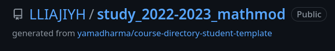
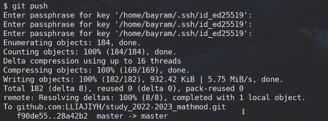

---
## Front matter
lang: ru-RU
title: Лабораторная работа 1 
## subtitle: Простейший шаблон
author:
  - Тагиев Б. А.
institute:
  - Российский университет дружбы народов, Москва, Россия
date: 09 февраля 2023

## i18n babel
babel-lang: russian
babel-otherlangs: english

## Formatting pdf
toc: false
toc-title: Содержание
slide_level: 2
aspectratio: 169
section-titles: true
theme: metropolis
mainfont: DejaVu Serif
romanfont: DejaVu Serif
sansfont: DejaVu Sans
monofont: DejaVu Sans Mono
header-includes:
 - \metroset{progressbar=frametitle,sectionpage=progressbar,numbering=fraction}
 - '\makeatletter'
 - '\beamer@ignorenonframefalse'
 - '\makeatother'
---

# Цель работы

Работа с рабочим пространством, работа с git-ом и markdown.

# Задание

 - Сделайте отчёт по предыдущей лабораторной работе в формате Markdown.
 - В качестве отчёта просьба предоставить отчёты в 3 форматах: pdf, docx и md (в архиве, поскольку он должен содержать скриншоты, Makefile и т.д.)

# Выполнение лабораторной работы

## Выполнение лабораторной работы

1. Создали репозиторий на Github, для того, чтобы сохранять там наши изменения. После создания репозитория клонируем его и создадим все файлы для нашего курса.

{ #fig:001 } 

## Выполнение лабораторной работы

2. Создали рабочее пространство для лабораторных работ, групповых проектов и т.д.

{ #fig:002 width=50%}

## Выполнение лабораторной работы

3. Запустим скрипт автоматического развертывания рабочего пространства, создания папок, лабораторных работ и отчетов. Отправим все эти изменения на Github.

{ #fig:003 width=70%}

## Выполнение лабораторной работы

{ #fig:004 width=70%}

## Выполнение лабораторной работы

4. На удаленном репозитории можно увидеть отправленные изменения

{ #fig:005 width=70%}

## Выполнение лабораторной работы

5. Дальше следует сделать отчет, который я прямо сейчас пишу, потому картинок не будет.

# Выводы

По мере выполнения данной работы, я вспомнил как работать с git-ом, как работать с markdown и как собирать markdown в PDF и в DOC файлы.

