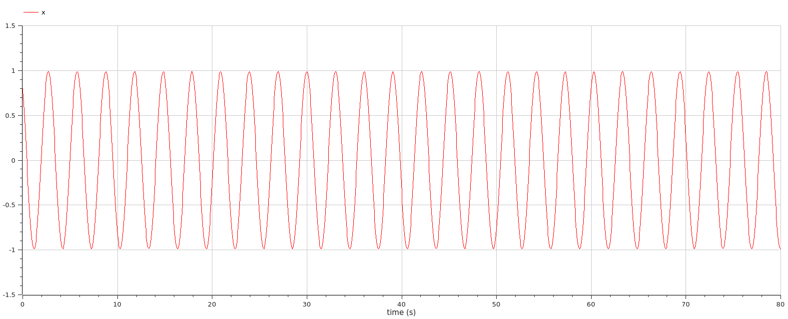
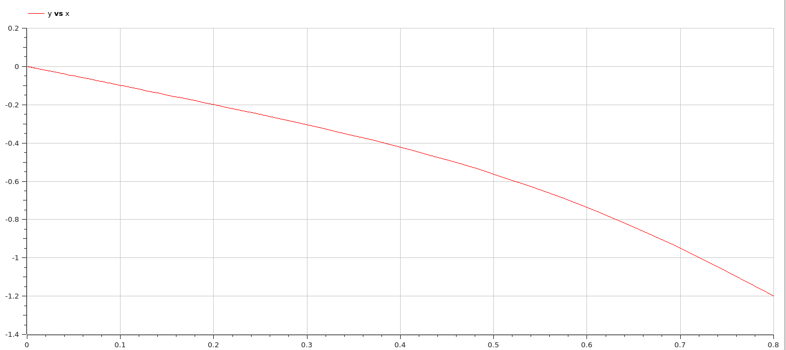
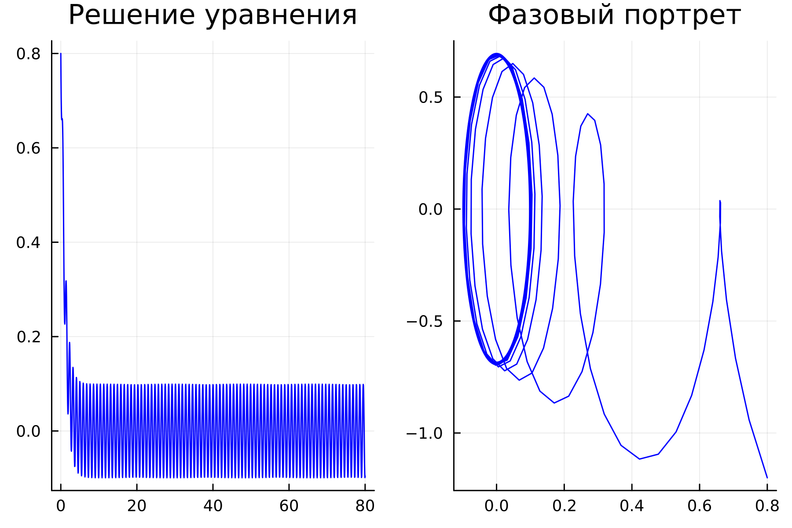
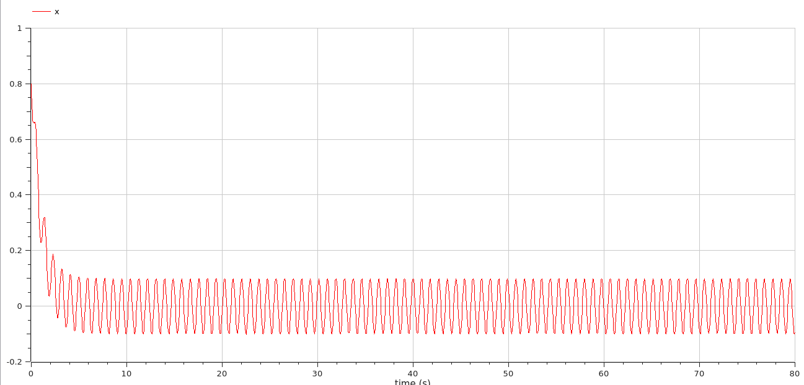

---
## Front matter
lang: ru-RU
title: Лабораторная работа 4
## subtitle: Простейший шаблон
author:
  - Тагиев Б. А.
institute:
  - Российский университет дружбы народов, Москва, Россия
date: 09 февраля 2023

## i18n babel
babel-lang: russian
babel-otherlangs: english

## Formatting pdf
toc: false
toc-title: Содержание
slide_level: 2
aspectratio: 169
section-titles: true
theme: metropolis
mainfont: DejaVu Serif
romanfont: DejaVu Serif
sansfont: DejaVu Sans
monofont: DejaVu Sans Mono
header-includes:
 - \metroset{progressbar=frametitle,sectionpage=progressbar,numbering=fraction}
 - '\makeatletter'
 - '\beamer@ignorenonframefalse'
 - '\makeatother'
---
# Цель работы

1. Построить решение уравнения гармонического осциллятора без затухания
2. Записать уравнение свободных колебаний гармонического осциллятора с затуханием, построить его решение. Построить фазовый портрет гармонических колебаний с затуханием.
3. Записать уравнение колебаний гармонического осциллятора, если на систему действует внешняя сила, построить его решение. Построить фазовый портрет колебаний с действием внешней силы.


# Задание

Постройте фазовый портрет гармонического осциллятора и решение уравнения
гармонического осциллятора для следующих случаев

1. Колебания гармонического осциллятора без затуханий и без действий внешней силы $$\ddot{x}+4.3x=0$$
2. Колебания гармонического осциллятора c затуханием и без действий внешней силы $$\ddot{x}+6\dot{x} + 5x=0$$
3. Колебания гармонического осциллятора c затуханием и под действием внешней силы $$\ddot{x}+10\dot{x} + 9x=8sin(7t)$$
На интервал $t \in [0; 80]$ (шаг 0.05) с начальными условиями $x_{0} = 0.8, y_{0} = -1.2$

# Выполнение лабораторной работы

## Колебания гармонического осциллятора без затуханий и без действий внешней силы

1. Зададим изначальные значения для решения варианта.

~~~julia
w = 4.3
g = 0.0
x₀ = 0.8
y₀ = -1.2
tspan = (0.0, 80.0)
~~~

##

2. Зададим наше уравнение для нахождения фазового портрета и решения уравнения на языке Julia (Полный исходный код представлен в репозитории) 

~~~julia
function ode_fn(du, u, p, t)
  x, y = u
  du[1] = u[2]
  du[2] = -w*u[1] - g*u[2]
end
~~~

##

3. Сохраним наш график в файл и посмотрим, что в нем хранится (рис. @fig:001).

{#fig:001 width=50%}

##

4. Расмотрим решение на OpenModelica (Полный исходный код представлен в репозитории). 

##

```modelica
model lab41
Real x;
Real y;
Real w = 4.3;
Real g = 0.0;
Real t = time;
initial equation
x = 0.8;
y = -1.2;
equation
der(x) = y;
der(y) = -w*x - g*y;
end lab41;
```

##

5. Здесь мы получаем аналогичное решение (@fig:011) и аналогичный фазовый портрет (@fig:012).

{#fig:011 width=50%}

##

{#fig:012 width=50%}

## Колебания гармонического осциллятора c затуханием и без действий внешней силы

1. Зададим изначальные значения для решения варианта.

~~~julia
w = 5.0
g = 6.0
x₀ = 0.8
y₀ = -1.2
tspan = (0.0, 80.0)
~~~

##

2. Зададим наше уравнение для нахождения фазового портрета и решения уравнения на языке Julia (Аналигчное тому, что было в коде из пунтка ранее. Полный исходный код представлен в репозитории)

##

3. Сохраним наш график в файл и посмотрим, что в нем хранится (рис. @fig:002).

{#fig:002 width=50%}

##

4. Расмотрим решение на OpenModelica (Полный исходный код представлен в репозитории). 

##

```modelica
model lab42
Real x;
Real y;
Real w = 5.0;
Real g = 6.0;
Real t = time;
initial equation
x = 0.8;
y = -1.2;
equation
der(x) = y;
der(y) = -w*x - g*y;
end lab42;
```

##

5. Здесь мы получаем аналогичное решение (@fig:013) и аналогичный фазовый портрет (@fig:014).

{#fig:013 width=50%}

##

{#fig:014 width=50%}

## Колебания гармонического осциллятора c затуханием и под действием внешней силы

1. Зададим изначальные значения для решения варианта.

~~~julia
w = 9.0
g = 10.0
x₀ = 0.8
y₀ = -1.2
tspan = (0.0, 80.0)
~~~

##

2. Зададим наше уравнение для нахождения фазового портрета и решения уравнения на языке Julia (Полный исходный код представлен в репозитории) 

~~~julia
function ode_fn(du, u, p, t)
  x, y = u
  du[1] = u[2]
  du[2] = -w*u[1] - g*u[2] + 8*sin(7*t) 
end
~~~

##

3. Сохраним наш график в файл и посмотрим, что в нем хранится (рис. @fig:003).

{#fig:003 width=50%}

##

4. Расмотрим решение на OpenModelica (Полный исходный код представлен в репозитории). 

##

```modelica
model lab43
Real x;
Real y;
Real w = 9.0;
Real g = 10.0;
Real t = time;
initial equation
x = 0.8;
y = -1.2;
equation
der(x) = y;
der(y) = -w*x - g*y + 8*sin(7*t);
end lab43;
```

##

5. Здесь мы получаем аналогичное решение (@fig:015) и аналогичный фазовый портрет (@fig:016).

{#fig:015 width=50%}

##

{#fig:016 width=50%}


# Выводы

Результатом работы стали по три модели в Julia и OpenModelica: конструкция модели колебаний в OpenModelica содержит меньше строк, чем аналогичная конструкция в Julia.

