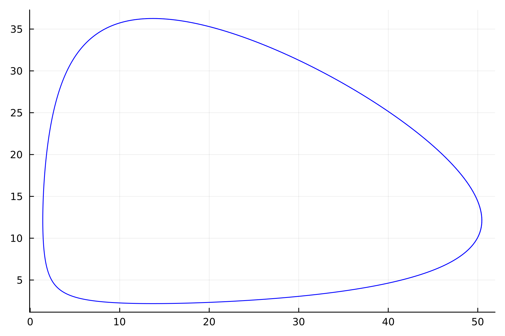
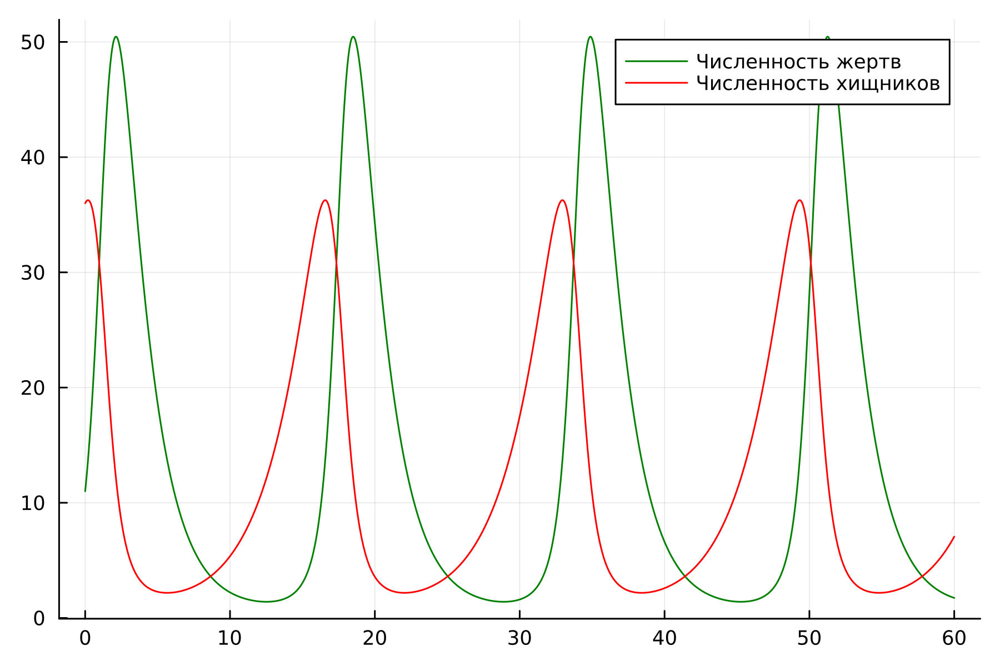
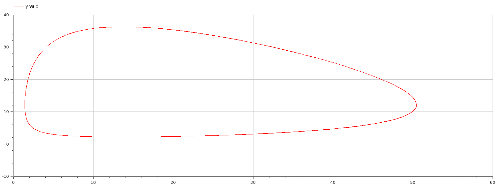

---
## Front matter
lang: ru-RU
title: Лабораторная работа 5
## subtitle: Простейший шаблон
author:
  - Тагиев Б. А.
institute:
  - Российский университет дружбы народов, Москва, Россия
date: 11 февраля 2023

## i18n babel
babel-lang: russian
babel-otherlangs: english

## Formatting pdf
toc: false
toc-title: Содержание
slide_level: 2
aspectratio: 169
section-titles: true
theme: metropolis
mainfont: DejaVu Serif
romanfont: DejaVu Serif
sansfont: DejaVu Sans
monofont: DejaVu Sans Mono
header-includes:
 - \metroset{progressbar=frametitle,sectionpage=progressbar,numbering=fraction}
 - '\makeatletter'
 - '\beamer@ignorenonframefalse'
 - '\makeatother'
---

# Цель работы

Целью данной работы является построение модели хищник-жертва.

# Задание

Для модели «хищник-жертва»:

1. Постройте график зависимости численности хищников от численности жертв

2. Графики изменения численности хищников и численности жертв при
следующих начальных условия $x_{0} = 11, y_{0}=36$. 

3. Найдите стационарное состояние системы.

# Выполнение 

## Выполнение 

:::::::::::::: {.columns align=center}
::: {.column width="30%"}

1. Опишем нашу модель на языке Julia, здесь мы задаем систему ДУ и начальные коеффициенты

:::
::: {.column width="70%"}

```julia
function ode_fn(du, u, p, t)
    x, y = u
    du[1] = -a*u[1] + b * u[1] * u[2]
    du[2] = c * u[2] - d * u[1] * u[2]
end
```

:::
::::::::::::::

## Выполнение 


2. Далее создадим график зависимости численности хищников от численности жертв

{#fig:001 width=40%}

## Выполнение 

3. И создадим график изменения численности хищников и численности жертв при начальных условия

{#fig:002 width=40%}

## Выполнение 

4. В стационарном случае (положение равновесия, не зависящее от времени решение) будет достигаться в точке $x_0 = c / d$ и $y_0 = a / b$. Давайте пронаблюдаем как будет выглядеть график изменения численности. Из определения стационарного случая, мы понимаем, что график не будет изменяться на протяжении всего времени.

## Выполнение 

{#fig:003 width=40%}

## Выполнение 

:::::::::::::: {.columns align=center}
::: {.column width="30%"}

5. Перейдем к OpenModelica. Данный код сделает нам нестационарный случай.

:::
::: {.column width="70%"}

```modelica
equation
  der(x) = -a*x + b*x*y;
  der(y) = c*y - d*x*y;
```

:::
::::::::::::::


## Выполнение 

6. График зависимости будет выглядеть следующим образом, аналогично тому, что было на языке Julia

{#fig:004 width=40%}

## Выполнение 

7. График изменения будет выглядеть аналогично тому, что мы строили на языке Julia.

{#fig:005 width=40%}

## Выполнение 

8. И, наконец, график стационарного случая будет выглядеть ровно также, как он был на языке Julia

{#fig:006 width=40%}

# Выводы

В итоге проделанной работы мы построили график зависимости численности хищников
от численности жертв, а также графики изменения численности хищников и
численности жертв на языках Julia и OpenModelica.

