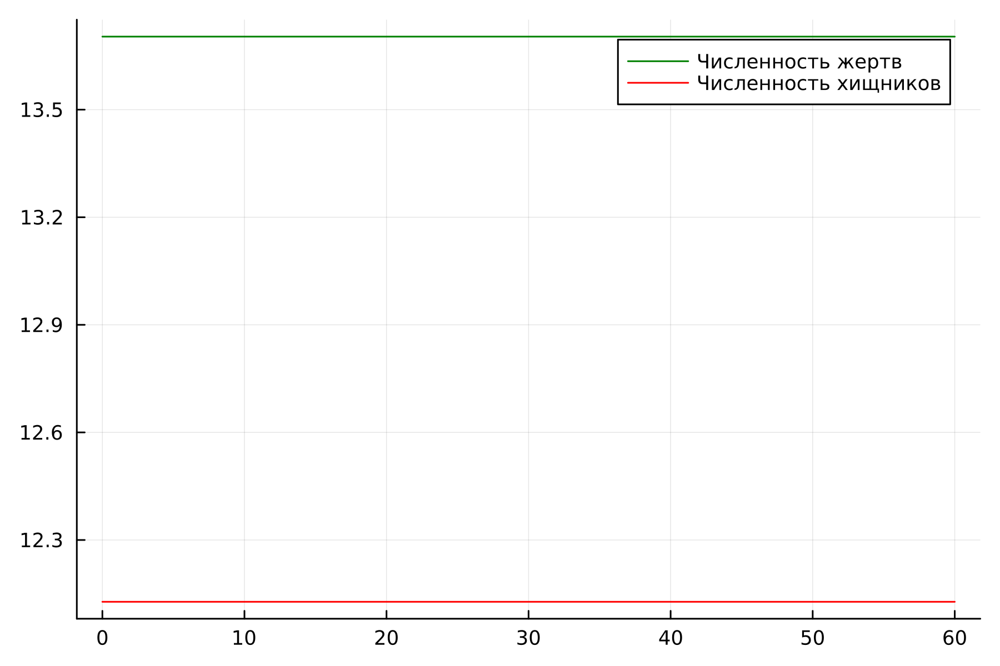
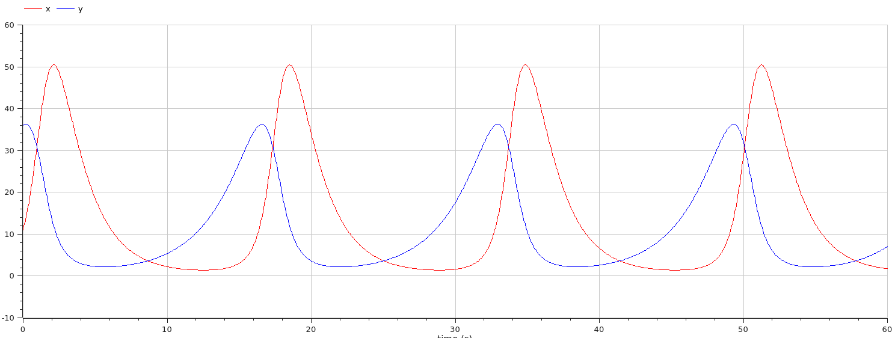
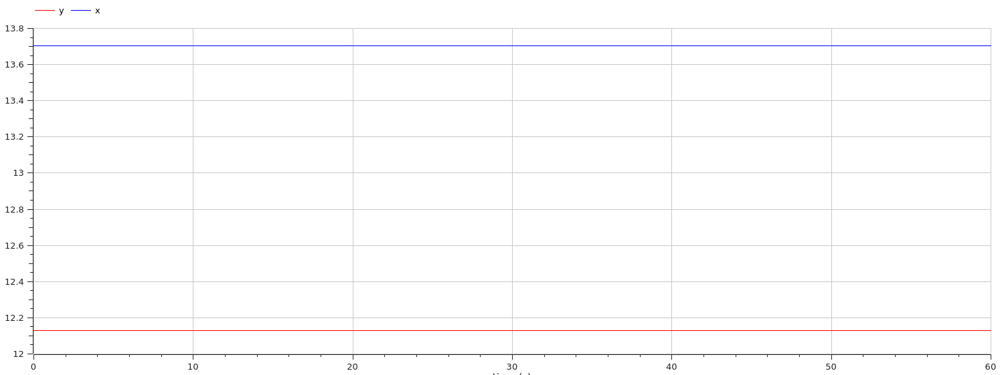

---
## Front matter
title: "Лабораторная работа 5"
##subtitle: "Простейший вариант"
author: "Тагиев Байрам Алтай оглы"

## Generic otions
lang: ru-RU
toc-title: "Содержание"

## Bibliography
bibliography: bib/cite.bib
csl: pandoc/csl/gost-r-7-0-5-2008-numeric.csl

## Pdf output format
toc: true # Table of contents
toc-depth: 2
lof: true # List of figures
lot: true # List of tables
fontsize: 12pt
linestretch: 1.5
papersize: a4
documentclass: scrreprt
## I18n polyglossia
polyglossia-lang:
  name: russian
  options:
	- spelling=modern
	- babelshorthands=true
polyglossia-otherlangs:
  name: english
## I18n babel
babel-lang: russian
babel-otherlangs: english
## Fonts
mainfont: DejaVu Serif
romanfont: DejaVu Serif
sansfont: DejaVu Sans
monofont: DejaVu Sans Mono
mainfontoptions: Ligatures=TeX
romanfontoptions: Ligatures=TeX
sansfontoptions: Ligatures=TeX,Scale=MatchLowercase
monofontoptions: Scale=MatchLowercase,Scale=0.9
## Biblatex
biblatex: true
biblio-style: "gost-numeric"
biblatexoptions:
  - parentracker=true
  - backend=biber
  - hyperref=auto
  - language=auto
  - autolang=other*
  - citestyle=gost-numeric
## Pandoc-crossref LaTeX customization
figureTitle: "Рис."
tableTitle: "Таблица"
listingTitle: "Листинг"
lofTitle: "Список иллюстраций"
lotTitle: "Список таблиц"
lolTitle: "Листинги"
## Misc options
indent: true
header-includes:
  - \usepackage{indentfirst}
  - \usepackage{float} # keep figures where there are in the text
  - \floatplacement{figure}{H} # keep figures where there are in the text
  - \usepackage{fvextra}
  - \DefineVerbatimEnvironment{Highlighting}{Verbatim}{breaklines,commandchars=\\\{\}}
---

# Цель работы

Целью данной работы является построение модели хищник-жертва.

# Задание

Для модели «хищник-жертва»:
1. Постройте график зависимости численности хищников от численности жертв
2. Графики изменения численности хищников и численности жертв при
следующих начальных условия $х_{0} = 11, y_{0}=36$. 
3. Найдите стационарное состояние системы.

# Теоретическое введение

Модель Лотки—Вольтерры (@wiki:lv_eq) — модель взаимодействия двух видов типа «хищник —
жертва», названная в честь её авторов, которые предложили модельные уравнения
независимо друг от друга. Такие уравнения можно использовать для моделирования
систем «хищник — жертва», «паразит — хозяин», конкуренции и других видов
взаимодействия между двумя видами.

Данная двувидовая модель основывается на следующих предположениях:

1. Численность популяции жертв x и хищников y зависят только от времени
(модель не учитывает пространственное распределение популяции на
занимаемой территории)
2. В отсутствии взаимодействия численность видов изменяется по модели
Мальтуса, при этом число жертв увеличивается, а число хищников падает
3. Естественная смертность жертвы и естественная рождаемость хищника
считаются несущественными
4. Эффект насыщения численности обеих популяций не учитывается
5. Скорость роста численности жертв уменьшается пропорционально
численности хищников

# Выполнение 

1. Опишем нашу модель на языке Julia, здесь мы задаем систему ДУ и начальные коеффициенты

```julia
x0 = 11
y0 = 36

a = 0.57
b = 0.047
c = 0.37
d = 0.027


function ode_fn(du, u, p, t)
    x, y = u
    du[1] = -a*u[1] + b * u[1] * u[2]
    du[2] = c * u[2] - d * u[1] * u[2]
end
```

2. Далее создадим график (@fig:001) зависимости численности хищников от численности жертв

{#fig:001 width=70%}

3. И создадим график (@fig:002) изменения численности хищников и численности жертв при начальных условия

{#fig:002 width=70%}

4. В стационарном случае (положение равновесия, не зависящее от времени решение) будет достигаться в точке $x_0 = c / d$ и $y_0 = a / b$. Давайте пронаблюдаем как будет выглядеть график изменения численности. Из определения стационарного случая, мы понимаем, что график не будет изменяться на протяжении всего времени.

{#fig:003 width=70%}

5. Перейдем к OpenModelica. Данный код сделает нам нестационарный случай.

```modelica
model lab51
  Real a = 0.57;
  Real b = 0.047;
  Real c = 0.37;
  Real d = 0.027;
  Real x;
  Real y;
initial equation
  x = 11;
  y = 36;
equation
  der(x) = -a*x + b*x*y;
  der(y) = c*y - d*x*y;
  annotation(experiment(StartTime = 0, StopTime = 60, Tolerance = 1e-06, Interval = 0.05));
end lab51;
```

6. График (@fig:004) зависимости будет выглядеть следующим образом, аналогично тому, что было на языке Julia

{#fig:004 width=70%}

7. График (@fig:005) изменения будет выглядеть аналогично тому, что мы строили на языке Julia.

{#fig:005 width=70%}

8. И, наконец, график (@fig:006) стационарного случая будет выглядеть ровно также, как он был на языке Julia

{#fig:006 width=70%}

# Выводы

В итоге проделанной работы мы построили график зависимости численности хищников
от численности жертв, а также графики изменения численности хищников и
численности жертв на языках Julia и OpenModelica.

# Библиография

