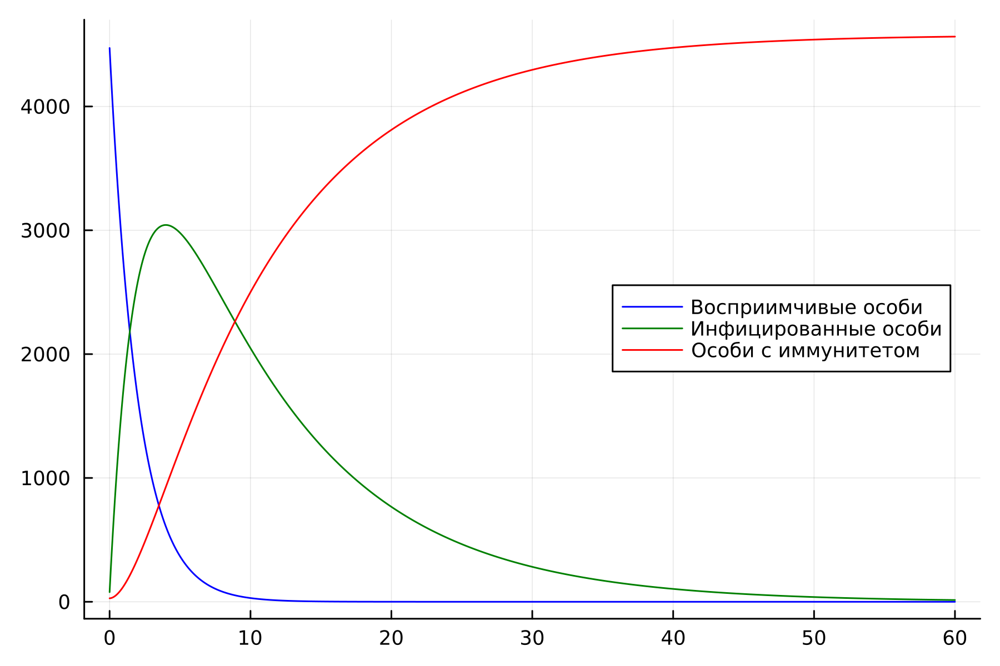
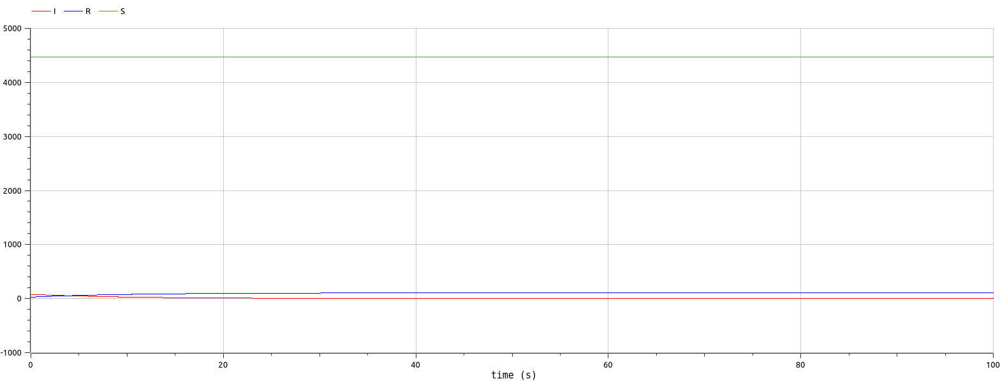
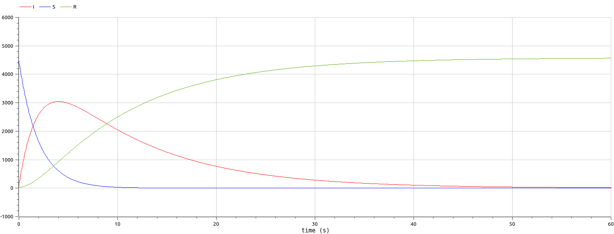

---
## Front matter
lang: ru-RU
title: Лабораторная работа 6
## subtitle: Простейший шаблон
author:
  - Тагиев Б. А.
institute:
  - Российский университет дружбы народов, Москва, Россия
date: 18 февраля 2023

## i18n babel
babel-lang: russian
babel-otherlangs: english

## Formatting pdf
toc: false
toc-title: Содержание
slide_level: 2
aspectratio: 169
section-titles: true
theme: metropolis
mainfont: DejaVu Serif
romanfont: DejaVu Serif
sansfont: DejaVu Sans
monofont: DejaVu Sans Mono
header-includes:
 - \metroset{progressbar=frametitle,sectionpage=progressbar,numbering=fraction}
 - '\makeatletter'
 - '\beamer@ignorenonframefalse'
 - '\makeatother'
---

# Цель работы

Целью данной работы является построение модели эпидемиологической ситуации.

# Задание

На одном острове вспыхнула эпидемия. Известно, что из всех проживающих на
острове ($N=4 578$) в момент начала эпидемии ($t=0$) число заболевших людей
(являющихся распространителями инфекции) $I(0)=78$, А число здоровых людей с
иммунитетом к болезни $R(0)=28$. Таким образом, число людей восприимчивых к
болезни, но пока здоровых, в начальный момент времени $S(0)=N-I(0)- R(0)$.
Постройте графики изменения числа особей в каждой из трех групп. Рассмотрите,
как будет протекать эпидемия в случае:

1. если $I(0) \leq I^{*}$

2. если $I(0) >  I^{*}$

# Выполнение 

## Выполнение

1. Опишем начальные условия для варианта 62 на языке Julia

```julia
N = 4578
I0 = 78	# заболевшие 
R0 = 28 # с иммунитетом
S0 = N - I0 - R0 # здоровые, но восприимчивые 
alpha = 0.5 # коэффициент заболеваемости
beta = 0.1 # коэффициент выздоровления
```

## Выполнение

2. Зададим соответствующую систему ДУ для первого случая (больные изолированы).

```julia
function ode_fn(du, u, p, t)
  S, I, R = u
  du[1] = 0
  du[2] = -beta*u[2]
  du[3] = beta*I
end
```

## Выполнение

3. Полный исходный код представлен в репозитории. Запустим вычисление и сохраним график. Давайте перейдем к расмотрению графика.

{#fig:001 width=40%}

## Выполнение

4. Изменим систему дифференциальных уравнений для второго случая, когда зараженные могут инфицировать особей из группы S

```julia
function ode_fn(du, u, p, t)
  S, I, R = u
  du[1] = -alpha*u[1]
  du[2] = alpha*u[1] - beta*u[2]
  du[3] = beta*I
end
```

## Выполнение

5. Полный исходный код представлен в репозитории. Также запустим вычисления и посмотрим, что происходит с особями. Здесь мы видим, что зараженные особи заражают восприимчивых особей, а после все зараженные особи получают иммунитет.

{#fig:002 width=35%}

## Выполнение

:::::::::::::: {.columns align=center}
::: {.column width="40%"}

6. Перейдем к OpenModelica. Далее представлен код для описания модели с изоляцией. Полный исходный код представлен в репозитории. 

:::
::: {.column width="60%"}

```modelica
equation
der(S) = 0;
der(I) = -beta*I;
der(R) = beta*I;
```

:::
::::::::::::::


## Выполнение

7. Если запустить симуляцию, то мы увидим следующие графики изменения количества особей в трех группах.

{#fig:003 width=40%}

## Выполнение

:::::::::::::: {.columns align=center}
::: {.column width="40%"}

8. Добавим в наше ДУ возможность заражения группы S. Полный исходный код представлен в репозитории.

:::
::: {.column width="60%"}

```modelica
equation
der(S) = -alpha*S;
der(I) = alpha*S - beta*I;
der(R) = beta*I;
```

:::
::::::::::::::


## Выполнение

9. Перейдем к симуляции и увидим следующия изменения.

{#fig:004 width=40%}


# Выводы

В итоге проделанной работы мы построили графики зависимости численности особей
трех групп S, I, R для случаев, когда больные изолированы и когда они могут
заражать особей группы S, на языках Julia и OpenModelica.
