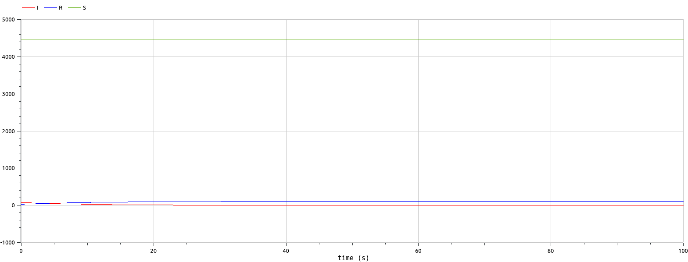

---
## Front matter
title: "Лабораторная работа 6"
##subtitle: "Простейший вариант"
author: "Тагиев Байрам Алтай оглы"

## Generic otions
lang: ru-RU
toc-title: "Содержание"

## Bibliography
bibliography: bib/cite.bib
csl: pandoc/csl/gost-r-7-0-5-2008-numeric.csl

## Pdf output format
toc: true # Table of contents
toc-depth: 2
lof: true # List of figures
lot: true # List of tables
fontsize: 12pt
linestretch: 1.5
papersize: a4
documentclass: scrreprt
## I18n polyglossia
polyglossia-lang:
  name: russian
  options:
	- spelling=modern
	- babelshorthands=true
polyglossia-otherlangs:
  name: english
## I18n babel
babel-lang: russian
babel-otherlangs: english
## Fonts
mainfont: DejaVu Serif
romanfont: DejaVu Serif
sansfont: DejaVu Sans
monofont: DejaVu Sans Mono
mainfontoptions: Ligatures=TeX
romanfontoptions: Ligatures=TeX
sansfontoptions: Ligatures=TeX,Scale=MatchLowercase
monofontoptions: Scale=MatchLowercase,Scale=0.9
## Biblatex
biblatex: true
biblio-style: "gost-numeric"
biblatexoptions:
  - parentracker=true
  - backend=biber
  - hyperref=auto
  - language=auto
  - autolang=other*
  - citestyle=gost-numeric
## Pandoc-crossref LaTeX customization
figureTitle: "Рис."
tableTitle: "Таблица"
listingTitle: "Листинг"
lofTitle: "Список иллюстраций"
lotTitle: "Список таблиц"
lolTitle: "Листинги"
## Misc options
indent: true
header-includes:
  - \usepackage{indentfirst}
  - \usepackage{float} # keep figures where there are in the text
  - \floatplacement{figure}{H} # keep figures where there are in the text
  - \usepackage{fvextra}
  - \DefineVerbatimEnvironment{Highlighting}{Verbatim}{breaklines,commandchars=\\\{\}}
---

# Цель работы

Целью данной работы является построение модели эпидемиологической ситуации.

# Задание

На одном острове вспыхнула эпидемия. Известно, что из всех проживающих на
острове ($N=4 578$) в момент начала эпидемии ($t=0$) число заболевших людей
(являющихся распространителями инфекции) $I(0)=78$, А число здоровых людей с
иммунитетом к болезни $R(0)=28$. Таким образом, число людей восприимчивых к
болезни, но пока здоровых, в начальный момент времени $S(0)=N-I(0)- R(0)$.
Постройте графики изменения числа особей в каждой из трех групп. Рассмотрите,
как будет протекать эпидемия в случае:

1. если $I(0) \leq I^{*}$

2. если $I(0) >  I^{*}$

# Теоретическое введение

Рассмотрим простейшую модель эпидемии. Предположим, что некая популяция,
состоящая из $N$ особей, (считаем, что популяция изолирована) подразделяется на
три группы. Первая группа - это восприимчивые к болезни, но пока здоровые
особи, обозначим их через $S(t)$. Вторая группа – это число инфицированных
особей, которые также при этом являются распространителями инфекции, обозначим
их $I(t)$. А третья группа, обозначающаяся через $R(t)$ – это здоровые особи с
иммунитетом к болезни. До того, как число заболевших не превышает критического
значения $I^{*}$, считаем, что все больные изолированы и не заражают здоровых.
Когда $I(0) >  I^{*}$, тогда инфицирование способны заражать восприимчивых к болезни
особей.

# Выполнение 

1. Опишем начальные условия для варианта 62 на языке Julia

```julia
N = 4578
I0 = 78	# заболевшие 
R0 = 28 # с иммунитетом
S0 = N - I0 - R0 # здоровые, но восприимчивые 
alpha = 0.5 # коэффициент заболеваемости
beta = 0.1 # коэффициент выздоровления
```

2. Зададим соответствующую систему ДУ для первого случая (больные изолированы).

```julia
function ode_fn(du, u, p, t)
  S, I, R = u
  du[1] = 0
  du[2] = -beta*u[2]
  du[3] = beta*I
end
```

3. Полный исходный код представлен в репозитории (@julia:task1). Запустим вычисление и сохраним график. Давайте перейдем к расмотрению графика. (@fig:001)

{#fig:001 width=50%}

4. Изменим систему дифференциальных уравнений для второго случая, когда зараженные могут инфицировать особей из группы S

```julia
function ode_fn(du, u, p, t)
  S, I, R = u
  du[1] = -alpha*u[1]
  du[2] = alpha*u[1] - beta*u[2]
  du[3] = beta*I
end
```

5. Полный исходный код представлен в репозитории (@julia:task2). Также запустим вычисления и посмотрим (@fig:002), что происходит с особями. Здесь мы видим, что зараженные особи заражают восприимчивых особей, а после все зараженные особи получают иммунитет.

{#fig:002 width=50%}

6. Перейдем к OpenModelica. Далее представлен код для описания модели с изоляцией. Полный исходный код представлен в репозитории (@OpenModelica:task1). 

```modelica
model lab06_1
Real N = 4578;
Real I;
Real R;
Real S;
Real alpha = 0.5;
Real beta = 0.1;
initial equation
I = 78;
R = 28;
S = N - I - R;
equation
der(S) = 0;
der(I) = -beta*I;
der(R) = beta*I;
end lab06_1;
```

7. Если запустить симуляцию, то мы увидим следующие графики (@fig:003) изменения количества особей в трех группах.

{#fig:003 width=50%}

8. Добавим в наше ДУ возможность заражения группы S. Полный исходный код представлен в репозитории (@OpenModelica:task2).

```modelica
equation
der(S) = -alpha*S;
der(I) = alpha*S - beta*I;
der(R) = beta*I;
```

9. Перейдем к симуляции и увидим следующия изменения (@fig:004).

{#fig:004 width=50%}


# Выводы

В итоге проделанной работы мы построили графики зависимости численности особей
трех групп S, I, R для случаев, когда больные изолированы и когда они могут
заражать особей группы S, на языках Julia и OpenModelica. 

# Библиография

