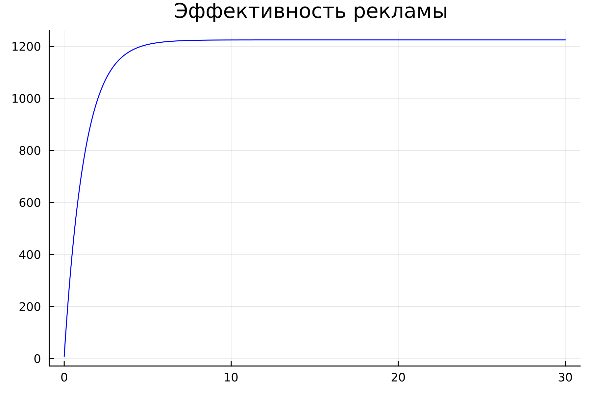
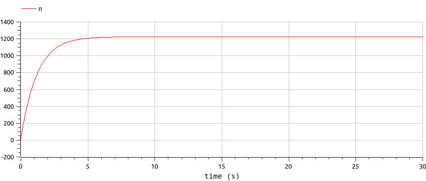
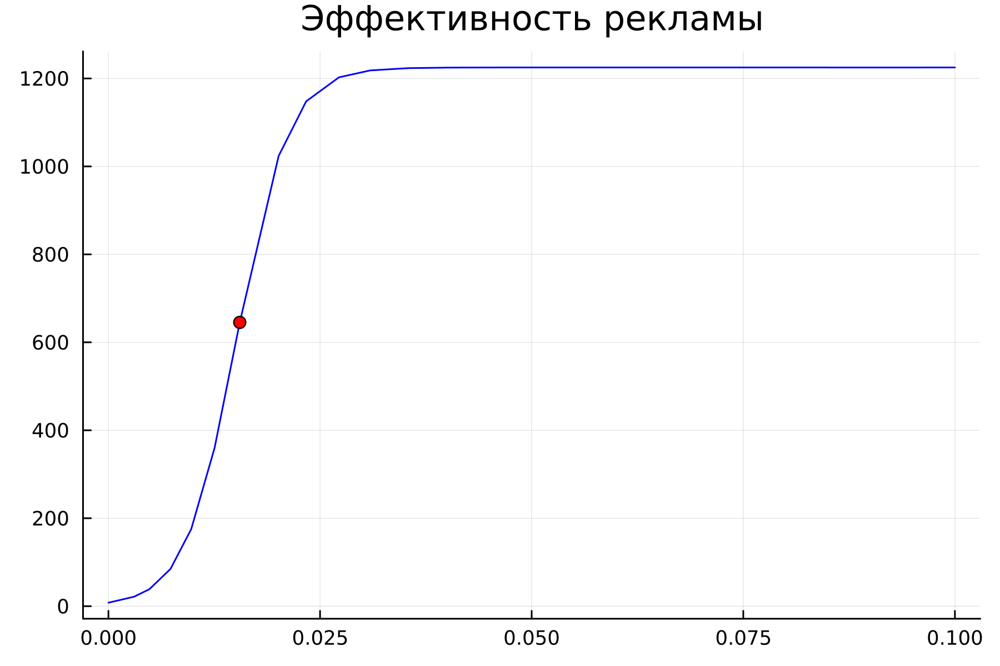
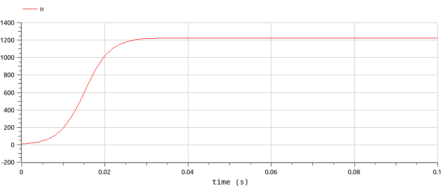
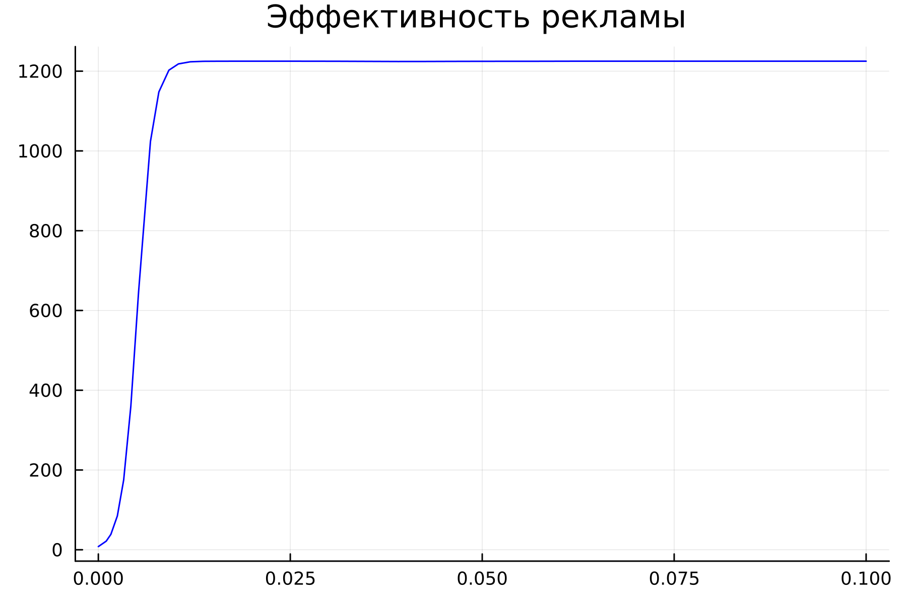

---
## Front matter
lang: ru-RU
title: Лабораторная работа 7
## subtitle: Простейший шаблон
author:
  - Тагиев Б. А.
institute:
  - Российский университет дружбы народов, Москва, Россия
date: 25 марта 2023

## i18n babel
babel-lang: russian
babel-otherlangs: english

## Formatting pdf
toc: false
toc-title: Содержание
slide_level: 2
aspectratio: 169
section-titles: true
theme: metropolis
mainfont: DejaVu Serif
romanfont: DejaVu Serif
sansfont: DejaVu Sans
monofont: DejaVu Sans Mono
header-includes:
 - '\metroset{progressbar=frametitle,sectionpage=progressbar,numbering=fraction}'
 - '\makeatletter'
 - '\beamer@ignorenonframefalse'
 - '\makeatother'
---

# Цель работы

Целью данной работы является построение модели распространения рекламы.

# Задание

Построить графики распространения рекламы для трех случаев. При этом объем
аудитории $N = 1225$, в начальный момент о товаре знает $8$ человек. Для случая
2 определить, в какой момент времени скорость распространения рекламы будет
иметь максимальное значение.

# Выполнение 

## Уравнение 1

:::::::::::::: {.columns align=center}
::: {.column width="70%"}

```julia
N = 1225
n0 = 8

function ode_fn(du, u, p, t)
  (n) = u
  du[1] = (0.815 + 0.000033*u[1])*(N - u[1])
end
```

:::
::: {.column width="30%"}

1. Напишем код на julia, которое решает первое уравнение варианта 62.

:::
::::::::::::::

## Уравнение 1

2. Сохраним результаты нашего решения в график и увидим следующее

{width=50%}

## Уравнение 1

:::::::::::::: {.columns align=center}
::: {.column width="70%"}

```modelica
model lab07_1
  Real N = 1225;
  Real n;
initial equation
  n = 8;
equation
  der(n) = (0.815 + 0.000033*n)*(N-n);
end lab07_1
```

:::
::: {.column width="30%"}

3. Теперь напишем код на языке Modelica.

:::
::::::::::::::

## Уравнение 1

4. Запустим сиуляцию и увидим следующее

{width=50%}

# Уравнение 2

:::::::::::::: {.columns align=center}
::: {.column width="70%"}

```julia
N = 1225
n0 = 8

function ode_fn(du, u, p, t)
  (n) = u
  du[1] = (0.000044 + 0.27*u[1])*(N - u[1])
end
```

:::
::: {.column width="30%"}


1. Напишем код на julia, которое решает второе уравнение варианта 62.

:::
::::::::::::::

## Уравнение 2

2. Сохраним результаты нашего решения в график и увидим следующее. Момент времени скорость распространения рекламы будет иметь максимальное значение также указан на графике.

{width=50%}

## Уравнение 2

:::::::::::::: {.columns align=center}
::: {.column width="70%"}

```modelica
model lab07_2
Real N = 1225;
Real n;
initial equation
n = 8;
equation
der(n) = (0.000044 + 0.27*n)*(N-n);
end lab07_2;
```

:::
::: {.column width="30%"}


3. Теперь напишем код на языке Modelica.

:::
::::::::::::::

## Уравнение 2

4. Запустим сиуляцию и увидим следующее

{width=50%}

## Уравнение 3

:::::::::::::: {.columns align=center}
::: {.column width="70%"}

```julia
N = 1225 
n0 = 8

function ode_fn(du, u, p, t)
  (n) = u
  du[1] = (0.5*t + 0.8*cos(t)*u[1])*(N - u[1])
end
```

:::
::: {.column width="30%"}

1. Напишем код на julia, которое решает третье уравнение варианта 62.

:::
::::::::::::::

## Уравнение 3


2. Сохраним результаты нашего решения в график и увидим следующее

{width=50%}

## Уравнение 3

:::::::::::::: {.columns align=center}
::: {.column width="70%"}

```modelica
model lab07_3
Real N = 1225;
Real n;
initial equation
n = 8;
equation
der(n) = (0.5 + 0.8*cos(time)*n)*(N-n);
end lab07_3;
```

:::
::: {.column width="30%"}

3. Теперь напишем код на языке Modelica.

:::
::::::::::::::

## Уравнение 3

4. Запустим сиуляцию и увидим следующее

{width=50%}

## Выводы

В итоге проделанной работы мы построили графики распространения рекламы для трех случаев на языках Julia и OpenModelica.

