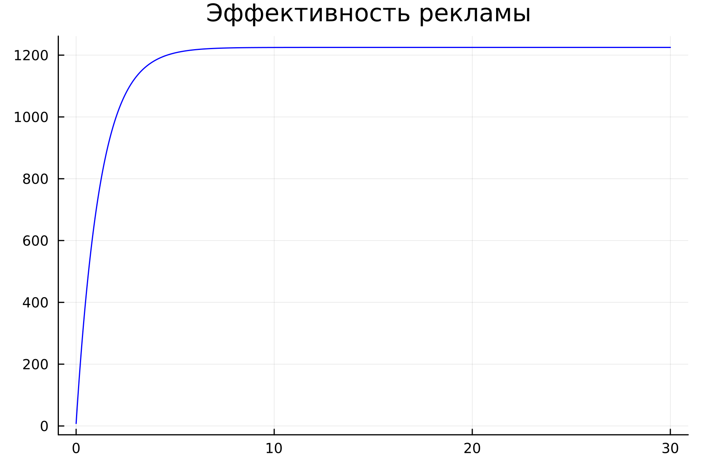
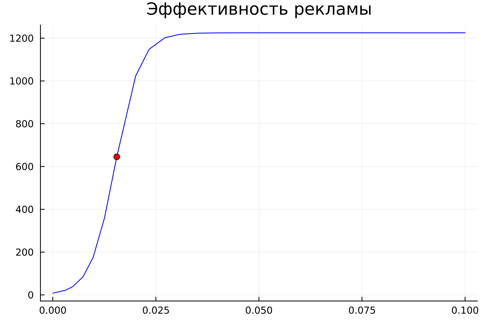

---
## Front matter
title: "Лабораторная работа 7"
##subtitle: "Простейший вариант"
author: "Тагиев Байрам Алтай оглы"

## Generic otions
lang: ru-RU
toc-title: "Содержание"

## Bibliography
bibliography: bib/cite.bib
csl: pandoc/csl/gost-r-7-0-5-2008-numeric.csl

## Pdf output format
toc: true # Table of contents
toc-depth: 2
lof: true # List of figures
lot: true # List of tables
fontsize: 12pt
linestretch: 1.5
papersize: a4
documentclass: scrreprt
## I18n polyglossia
polyglossia-lang:
  name: russian
  options:
	- spelling=modern
	- babelshorthands=true
polyglossia-otherlangs:
  name: english
## I18n babel
babel-lang: russian
babel-otherlangs: english
## Fonts
mainfont: DejaVu Serif
romanfont: DejaVu Serif
sansfont: DejaVu Sans
monofont: DejaVu Sans Mono
mainfontoptions: Ligatures=TeX
romanfontoptions: Ligatures=TeX
sansfontoptions: Ligatures=TeX,Scale=MatchLowercase
monofontoptions: Scale=MatchLowercase,Scale=0.9
## Biblatex
biblatex: true
biblio-style: "gost-numeric"
biblatexoptions:
  - parentracker=true
  - backend=biber
  - hyperref=auto
  - language=auto
  - autolang=other*
  - citestyle=gost-numeric
## Pandoc-crossref LaTeX customization
figureTitle: "Рис."
tableTitle: "Таблица"
listingTitle: "Листинг"
lofTitle: "Список иллюстраций"
lotTitle: "Список таблиц"
lolTitle: "Листинги"
## Misc options
indent: true
header-includes:
  - \usepackage{indentfirst}
  - \usepackage{float} # keep figures where there are in the text
  - \floatplacement{figure}{H} # keep figures where there are in the text
  - \usepackage{fvextra}
  - \DefineVerbatimEnvironment{Highlighting}{Verbatim}{breaklines,commandchars=\\\{\}}
---

# Цель работы

Целью данной работы является построение модели распространения рекламы.

# Задание

Построить графики распространения рекламы для трех случаев. При этом объем
аудитории $N = 1225$, в начальный момент о товаре знает $8$ человек. Для случая
2 определить, в какой момент времени скорость распространения рекламы будет
иметь максимальное значение.

# Теоретическое введение

Мальтузианская модель роста (@wiki:Malthusian_growth_model), также называемая моделью Мальтуса — это
экспоненциальный рост с постоянным темпом. Модель названа в честь английского
демографа и экономиста Томаса Мальтуса. 

Модель рекламной кампании описывается следующими величинами. Считаем, что
$dn/dt$ - скорость изменения со временем числа потребителей, узнавших о товаре
и готовых его купить, $t$ - время, прошедшее с начала рекламной кампании,
$nt()$ - число уже информированных клиентов. Эта величина пропорциональна числу
покупателей, еще не знающих о нем, это описывается следующим образом:
$\alpha_1(t)(N-n(t))$, где N - общее число потенциальных платежеспособных
покупателей, $\alpha_1(t) > 0$ - характеризует интенсивность рекламной кампании
(зависит от затрат на рекламу в данный момент времени). Помимо этого, узнавшие
о товаре потребители также распространяют полученную информацию среди
потенциальных покупателей, не знающих о нем (в этом случае работает т.н.
сарафанное радио). Этот вклад в рекламу описывается величиной
$\alpha_2(t)n(t)(N-n(t))$, эта величина увеличивается с увеличением
потребителей, унавших о товаре. 

# Выполнение 

## Уравнение 1

1. Напишем код на julia, которое решает первое уравнение варианта 62.

```julia
N = 1225
n0 = 8

function ode_fn(du, u, p, t)
  (n) = u
  du[1] = (0.815 + 0.000033*u[1])*(N - u[1])
end
```

2. Сохраним результаты нашего решения в график и увидим следующее (@fig:001)

{#fig:001 width=50%}

3. Теперь напишем код на языке Modelica.

```modelica
model lab07_1
  Real N = 1225;
  Real n;
initial equation
  n = 8;
equation
  der(n) = (0.815 + 0.000033*n)*(N-n);
end lab07_1
```
4. Запустим сиуляцию и увидим следующее (@fig:002)

{#fig:002 width=50%}

## Уравнение 2

1. Напишем код на julia, которое решает второе уравнение варианта 62.

```julia
N = 1225
n0 = 8

function ode_fn(du, u, p, t)
  (n) = u
  du[1] = (0.000044 + 0.27*u[1])*(N - u[1])
end
```

2. Сохраним результаты нашего решения в график и увидим следующее (@fig:003). Момент времени скорость распространения рекламы будет иметь максимальное значение также указан на графике.

{#fig:003 width=50%}

3. Теперь напишем код на языке Modelica.

```modelica
model lab07_2
Real N = 1225;
Real n;
initial equation
n = 8;
equation
der(n) = (0.000044 + 0.27*n)*(N-n);
end lab07_2;
```
4. Запустим сиуляцию и увидим следующее (@fig:004)

{#fig:004 width=50%}

## Уравнение 3

1. Напишем код на julia, которое решает третье уравнение варианта 62.

```julia
N = 1225 
n0 = 8

function ode_fn(du, u, p, t)
  (n) = u
  du[1] = (0.5*t + 0.8*cos(t)*u[1])*(N - u[1])
end
```

2. Сохраним результаты нашего решения в график и увидим следующее (@fig:005)

{#fig:005 width=50%}

3. Теперь напишем код на языке Modelica.

~~~modelica
model lab07_3
Real N = 1225;
Real n;
initial equation
n = 8;
equation
der(n) = (0.5 + 0.8*cos(time)*n)*(N-n);
end lab07_3;
~~~

4. Запустим сиуляцию и увидим следующее (@fig:006)

{#fig:006 width=50%}

# Выводы

В итоге проделанной работы мы построили графики распространения рекламы для трех случаев на языках Julia и OpenModelica.

# Библиография

