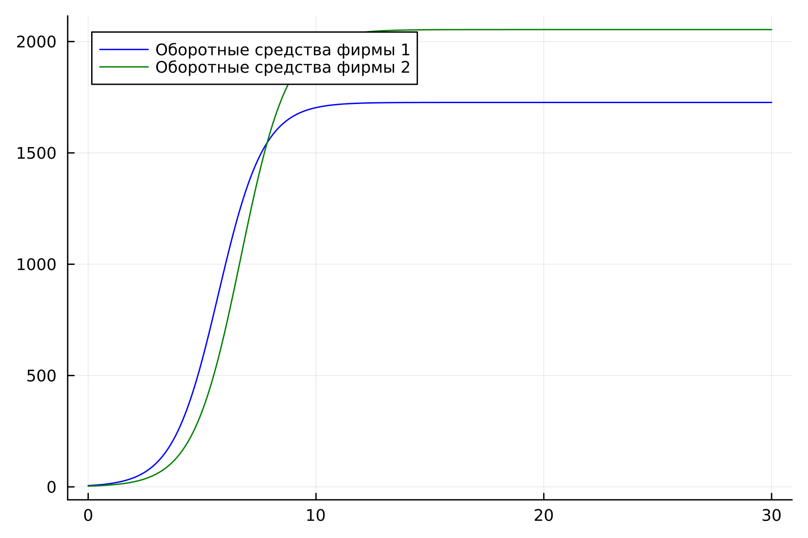
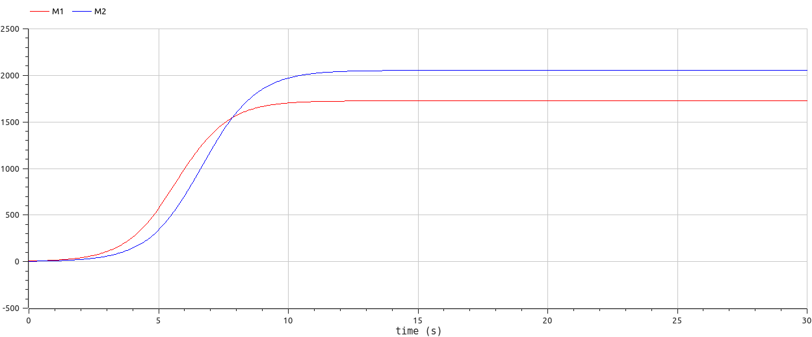
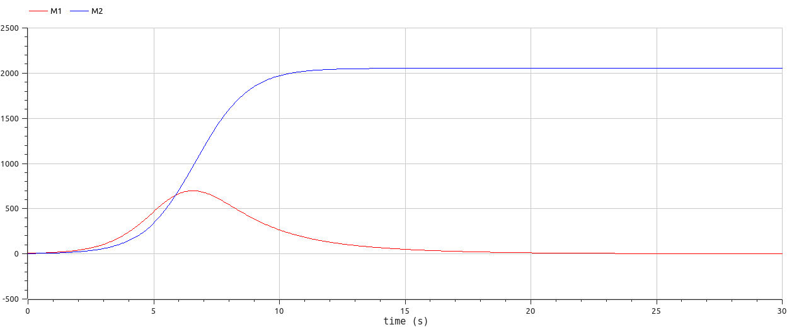

---
## Front matter
lang: ru-RU
title: Лабораторная работа 8
## subtitle: Простейший шаблон
author:
  - Тагиев Б. А.
institute:
  - Российский университет дружбы народов, Москва, Россия
date: 31 марта 2023

## i18n babel
babel-lang: russian
babel-otherlangs: english

## Formatting pdf
toc: false
toc-title: Содержание
slide_level: 2
aspectratio: 169
section-titles: true
theme: metropolis
mainfont: DejaVu Serif
romanfont: DejaVu Serif
sansfont: DejaVu Sans
monofont: DejaVu Sans Mono
header-includes:
 - '\metroset{progressbar=frametitle,sectionpage=progressbar,numbering=fraction}'
 - '\makeatletter'
 - '\beamer@ignorenonframefalse'
 - '\makeatother'
---

## Цель работы

Целью данной работы является построение модели конкуренции двух фирм.

## Задание

1. Построить графики изменения оборотных средств фирмы 1 и фирмы 2 для случая, когда конкурентная борьба ведётся только рыночными методами.

2. Построить графики изменения оборотных средств фирмы 1 и фирмы 2 для случая, когда, помимо экономического фактора влияния, используются еще и социально-психологические факторы.

# Выполнение

## Первый случай

1. Опишем систему ДУ для первого случая, когда конкурентная борьба ведется только рыночными методами.

~~~julia

function ode_fn(du, u, p, t)
  du[1] = u[1] - b / c1*u[1] * u[2] - a1 / c1*u[1] * u[1]
  du[2] = c2 / c1*u[2] - b / c1*u[1] * u[2] - a2 / c1*u[2] * u[2]
end

~~~

## Первый случай

2. Зададим начальные условия, заупустим просчет и сохраним результат в графики.

{#fig:001 width=50%}

## Первый случай

3. Смоделируем первый случай на OpenModelica, зададим начальные значения и систему ДУ.

~~~modelica
equation
  der(M1) = M1 - b/c1*M1*M2 - a1/c1*M1*M1;
  der(M2) = c2/c1*M2 - b/c1*M1*M2 - a2/c1*M2*M2;
~~~

## Первый случай

4. Запустим симуляцию и получим следующий результат.

{#fig:002 width=50%}

## Второй случай

1. Опишем систему ДУ для второго случая, когда конкурентная борьба ведется не только рыночными методами.

~~~julia

function ode_fn(du, u, p, t)
  du[1] = u[1] - (b / c1 + 0.00062)*u[1] * u[2] - a1 / c1*u[1] * u[1]
  du[2] = c2 / c1*u[2] - b / c1*u[1] * u[2] - a2 / c1*u[2] * u[2]
end

~~~

## Второй случай

2. Зададим начальные условия, заупустим просчет и сохраним результат в графики.

{#fig:003 width=50%}

## Второй случай

3. Смоделируем второй случай на OpenModelica, зададим начальные значения и систему ДУ.

~~~modelica
equation
  der(M1) = M1 - (b / c1 + 0.00062) * M1 * M2 - a1 / c1 * M1 * M1;
  der(M2) = c2 / c1 * M2 - b / c1 * M1 * M2 - a2 / c1 * M2 * M2;
~~~

## Второй случай

4. Запустим симуляцию и получим следующий результат.

{#fig:004 width=50%}

## Выводы

В итоге проделанной работы на языках Julia и OpenModelica мы построили графики
изменения оборотных средств для двух фирм для случаев, когда конкурентная
борьба ведётся только рыночными методами и когда, помимо экономического фактора
влияния, используются еще и социально-психологические факторы.
