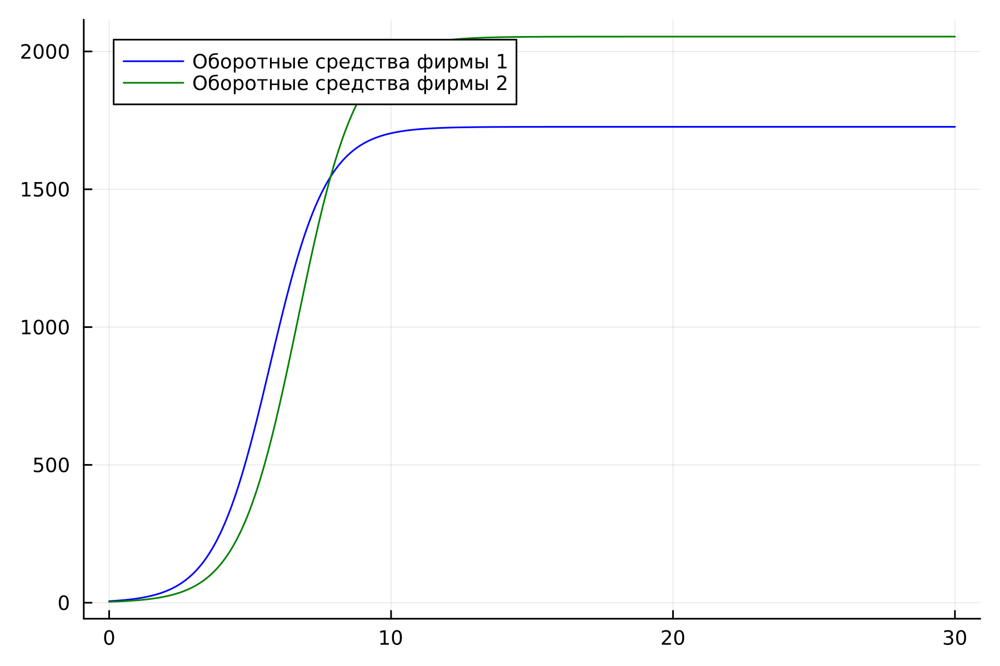
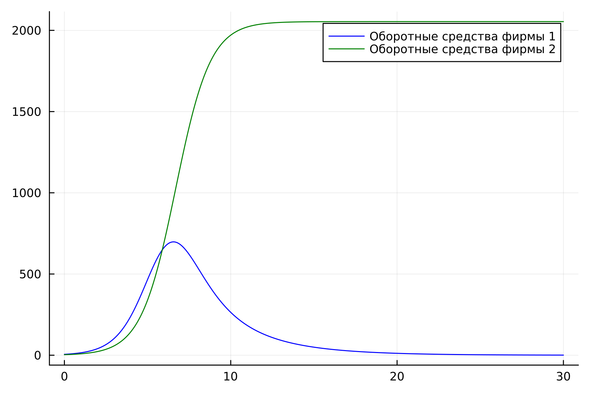
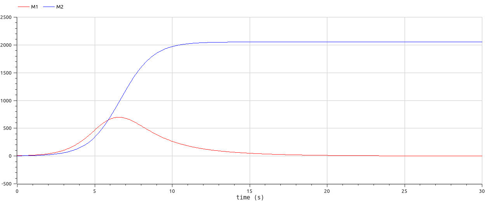

---
## Front matter
title: "Лабораторная работа 8"
##subtitle: "Простейший вариант"
author: "Тагиев Байрам Алтай оглы"

## Generic otions
lang: ru-RU
toc-title: "Содержание"

## Bibliography
bibliography: bib/cite.bib
csl: pandoc/csl/gost-r-7-0-5-2008-numeric.csl

## Pdf output format
toc: true # Table of contents
toc-depth: 2
lof: true # List of figures
lot: true # List of tables
fontsize: 12pt
linestretch: 1.5
papersize: a4
documentclass: scrreprt
## I18n polyglossia
polyglossia-lang:
  name: russian
  options:
	- spelling=modern
	- babelshorthands=true
polyglossia-otherlangs:
  name: english
## I18n babel
babel-lang: russian
babel-otherlangs: english
## Fonts
mainfont: DejaVu Serif
romanfont: DejaVu Serif
sansfont: DejaVu Sans
monofont: DejaVu Sans Mono
mainfontoptions: Ligatures=TeX
romanfontoptions: Ligatures=TeX
sansfontoptions: Ligatures=TeX,Scale=MatchLowercase
monofontoptions: Scale=MatchLowercase,Scale=0.9
## Biblatex
biblatex: true
biblio-style: "gost-numeric"
biblatexoptions:
  - parentracker=true
  - backend=biber
  - hyperref=auto
  - language=auto
  - autolang=other*
  - citestyle=gost-numeric
## Pandoc-crossref LaTeX customization
figureTitle: "Рис."
tableTitle: "Таблица"
listingTitle: "Листинг"
lofTitle: "Список иллюстраций"
lotTitle: "Список таблиц"
lolTitle: "Листинги"
## Misc options
indent: true
header-includes:
  - \usepackage{indentfirst}
  - \usepackage{float} # keep figures where there are in the text
  - \floatplacement{figure}{H} # keep figures where there are in the text
  - \usepackage{fvextra}
  - \DefineVerbatimEnvironment{Highlighting}{Verbatim}{breaklines,commandchars=\\\{\}}
---

# Цель работы

Целью данной работы является построение модели конкуренции двух фирм.

# Задание

1. Построить графики изменения оборотных средств фирмы 1 и фирмы 2 для случая, когда конкурентная борьба ведётся только рыночными методами.

2. Построить графики изменения оборотных средств фирмы 1 и фирмы 2 для случая, когда, помимо экономического фактора влияния, используются еще и социально-психологические факторы.

# Теоретическое введение

Для построения модели конкуренции хотя бы двух фирм необходимо рассмотреть
модель одной фирмы ([1]). Вначале рассмотрим модель фирмы, производящей продукт
долговременного пользования, когда цена его определяется балансом спроса и
предложения. Примем, что этот продукт занимает определенную нишу рынка и
конкуренты в ней отсутствуют. Обозначим:

N – число потребителей производимого продукта.

S – доходы потребителей данного продукта. Считаем, что доходы всех потребителей
одинаковы. Это предположение справедливо, если речь идет об одной рыночной
нише, т.е. производимый продукт ориентирован на определенный слой населения.

M – оборотные средства предприятия

τ – длительность производственного цикла

p – рыночная цена товара

p̃ – себестоимость продукта, то есть переменные издержки на производство единицы
продукции.

δ – доля оборотных средств, идущая на покрытие переменных издержек.

κ – постоянные издержки, которые не зависят от количества выпускаемой
продукции.

И построим дифференциальное уравнение:

$\frac{dM}{dy} = M \frac{\delta}{\tau}(\frac{p_{cr}}{\tilde{p}} - 1) - M^2(\frac{\delta}{\tau\tilde{p}})^2\frac{p_{cr}}{Nq} - k$

# Выполнение

## Первый случай

1. Опишем систему ДУ для первого случая, когда конкурентная борьба ведется только рыночными методами.

~~~julia

function ode_fn(du, u, p, t)
  du[1] = u[1] - b / c1*u[1] * u[2] - a1 / c1*u[1] * u[1]
  du[2] = c2 / c1*u[2] - b / c1*u[1] * u[2] - a2 / c1*u[2] * u[2]
end

~~~

2. Зададим начальные условия, заупустим просчет и сохраним результат в графики (@fig:001).

{#fig:001 width=50%}

3. Смоделируем первый случай на OpenModelica, зададим начальные значения и систему ДУ.

~~~modelica
equation
  der(M1) = M1 - b/c1*M1*M2 - a1/c1*M1*M1;
  der(M2) = c2/c1*M2 - b/c1*M1*M2 - a2/c1*M2*M2;
~~~

4. Запустим симуляцию и получим следующий результат (@fig:002).

{#fig:002 width=50%}

## Второй случай

1. Опишем систему ДУ для второго случая, когда конкурентная борьба ведется не только рыночными методами.

~~~julia

function ode_fn(du, u, p, t)
  du[1] = u[1] - (b / c1 + 0.00062)*u[1] * u[2] - a1 / c1*u[1] * u[1]
  du[2] = c2 / c1*u[2] - b / c1*u[1] * u[2] - a2 / c1*u[2] * u[2]
end

~~~

2. Зададим начальные условия, заупустим просчет и сохраним результат в графики (@fig:003).

{#fig:003 width=50%}

3. Смоделируем второй случай на OpenModelica, зададим начальные значения и систему ДУ.

~~~modelica
equation
  der(M1) = M1 - (b / c1 + 0.00062) * M1 * M2 - a1 / c1 * M1 * M1;
  der(M2) = c2 / c1 * M2 - b / c1 * M1 * M2 - a2 / c1 * M2 * M2;
~~~

4. Запустим симуляцию и получим следующий результат (@fig:004)

{#fig:004 width=50%}

# Выводы

В итоге проделанной работы на языках Julia и OpenModelica мы построили графики
изменения оборотных средств для двух фирм для случаев, когда конкурентная
борьба ведётся только рыночными методами и когда, помимо экономического фактора
влияния, используются еще и социально-психологические факторы.

# Список литературы

[1] Лабораторная работа:
https://esystem.rudn.ru/pluginfile.php/1971672/mod_resource/content/2/%D0%9B%D0%B0%D0%B1%D0%BE%D1%80%D0%B0%D1%82%D0%BE%D1%80%D0%BD%D0%B0%D1%8F%20%D1%80%D0%B0%D0%B1%D0%BE%D1%82%D0%B0%20%E2%84%96%207.pdf
